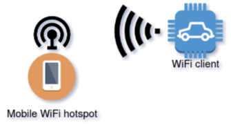
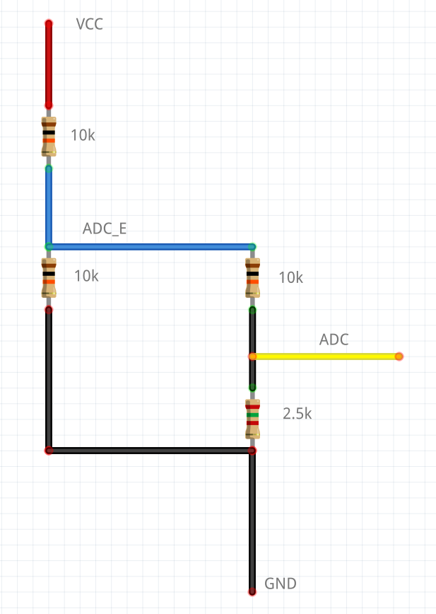
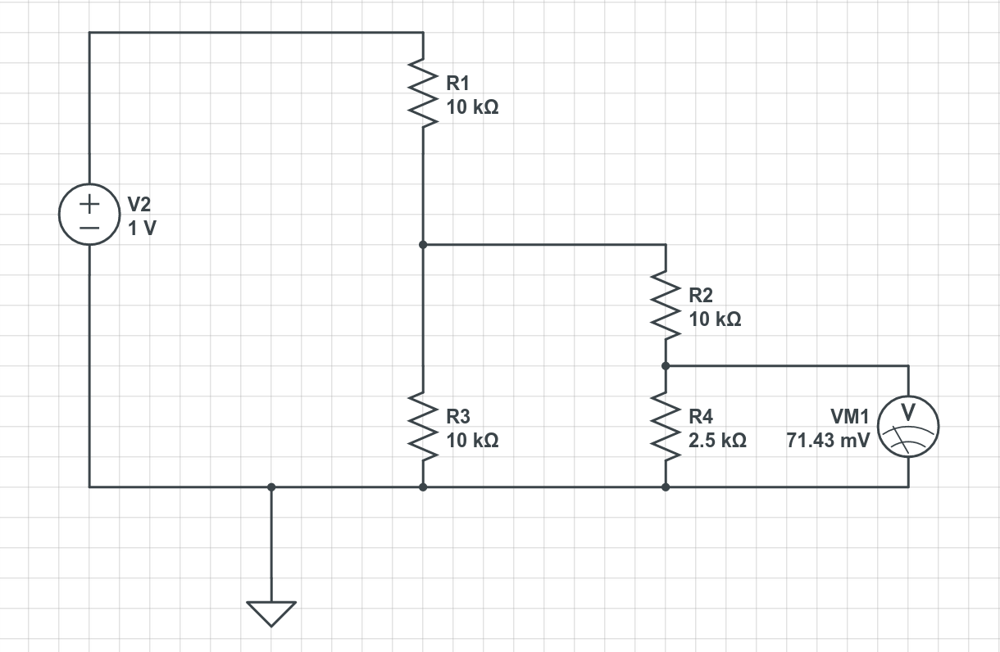
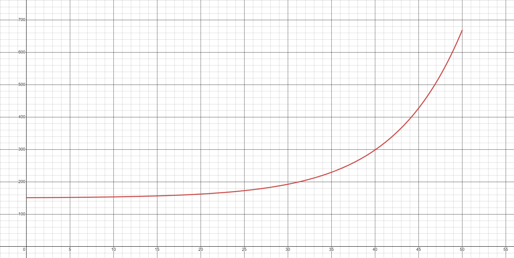
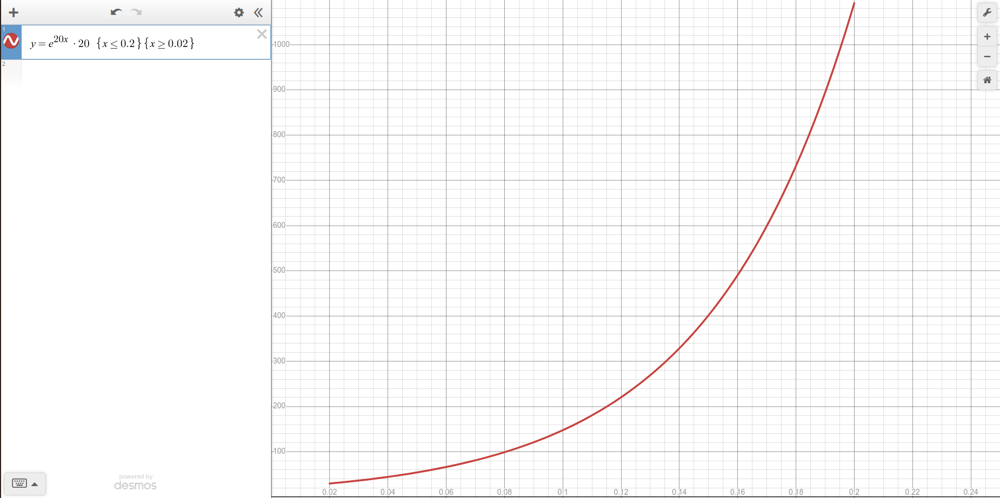
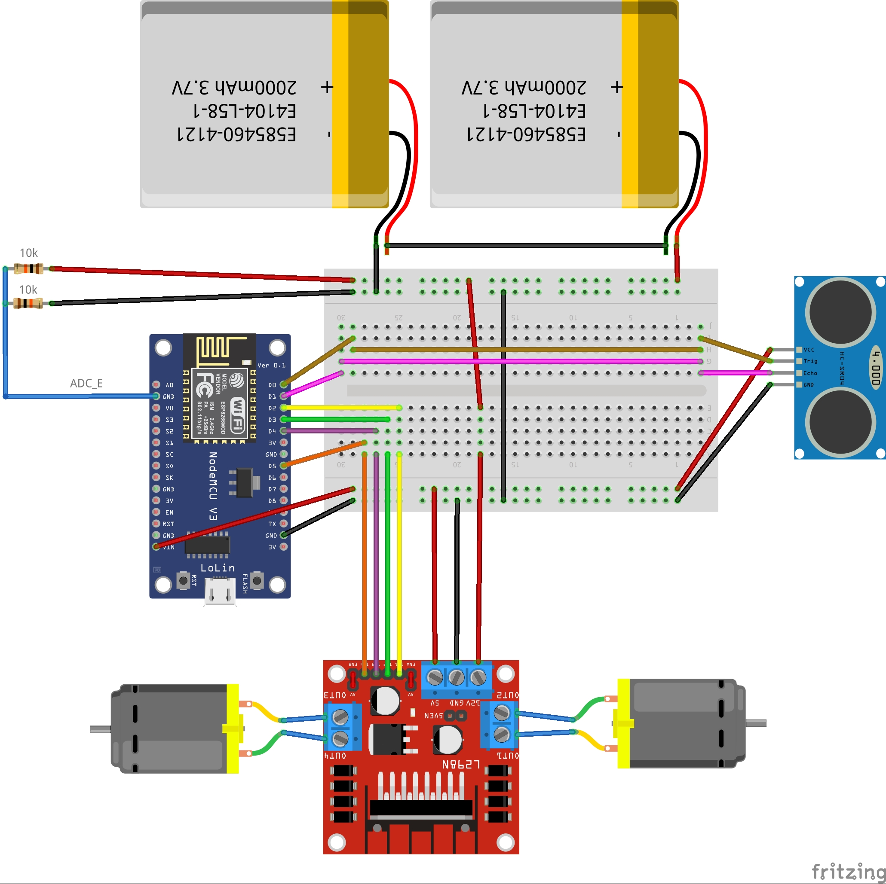

# ESP8266 full-duplex remote control

## Introduction

This project demonstrates full-duplex communication between ESP8266 and android device. Android device runs hotspot which ESP8266 connects to. Another possible configuration could be using controlling over Internet. Also Nova2 board is used, all said is valid for other boards with ESP8266. 

RC car toy is used for implementation. Android APK controls RC car and displays various metrics. ESP8266 is connected to RC car which controls.

## Prerequsites

- Android 9+ device
- Development environment with:
    - [JAVA 11](https://www.oracle.com/java/technologies/javase/jdk11-archive-downloads.html)
    - [Android studio](https://developer.android.com/studio)
    - [VS Code](https://code.visualstudio.com/)
        - [PlatformIO IDE extension](https://platformio.org/install/ide?install=vscode)
- [Electronic components](#wiring)

## Usage

- Android part
    1. Clone git repo
    2. Open /android/ directory and build application
    3. Install application to android device
- ESP8266 part
    1. [Connect the wiring](#wiring)
    2. Open /arduino/
    3. Configure ESP8266 code globals (hotspot Wi-Fi name and password)
    4. Compile and upload ESP8266 code (can be done by using PIO extension and VScode)
- Establishing connection
    1. Start hotspot at Android device with defined credentials
    2. Wait till esp8266 connects
    3. Launch the application and add IP and port to the configuration
    4. Press START button!

## Communication

- android device serves as Wi-Fi hotspot
- ESP8266 acts as client connecting to hotspot
    
    
    
- both android device and ESP8266 act as servers listening for specified port, and clients by connecting to another port and sending data
- UDP at transport layer is used
- Android device
    - listens at UDP port 2 for incoming messages
    - sends messages to ESP8266 at port 1
- ESP8266
    - listens at UDP port 1 for incoming messages
    - sends messages to android device at port 2
- Both devices can send messages simultaneously → full-duplex
    - (maybe not best implementation of full-duplex)

### Why UDP

UDP is used because it perfectly satisfies all our needs. UDP is very simple protocol, we don’t have connection establishment or acknowledges. 

We are sending stream of packages, so we can handle possible loss of packets. If some packages are lost, next will cover them up.

Any type of acknowledgments wouldn’t have much of sense, because package should be resent. Only purpose of acknowledgments could be to alert us if communication is alive, but that would decrease the bandwidth.

Small overhead and entire control packets fit inside single datagram.

## Metrics

ESP8266 sends information about:

- battery voltage (battery power)
- current (battery load)
- ultrasonic sensor reading (parking sensor)

### Used voltage divider for Nova2 board

Voltage divider for measuring battery voltage (MAX 8.4 V), because ESP8266 analog port is limited up to 1 V. Left resistors are external, right two are Nova2 integrated resistors which are allowing to measure up to 5 V, which is still not enough.

⚠️ More info about Nova2 scheme at this [link](https://github.com/e-radionicacom/Croduino-NOVA2-Eagle-Files/blob/master/v1.0/Croduino).

### Parking sensor alerting function

X axis - measured distance

Y axis - delay between sound signals

## Controls

Android APK allows following controls:

- left/right (steering with accelerometer sensor)
- forward/backward (accelerating with slider)

Controls are packed and transmitted, then ESP8266 consumes them. 

ESP8266 has built in PWM which acquires range from 0 to 1023 by default. In other words, it provides 0 to 1024 different values for calibrating duty cycle.

### Steering function

X axis - android device accelerometer sensor value

Y axis - value ESP8266 receives and applies as PWM

## Wiring

